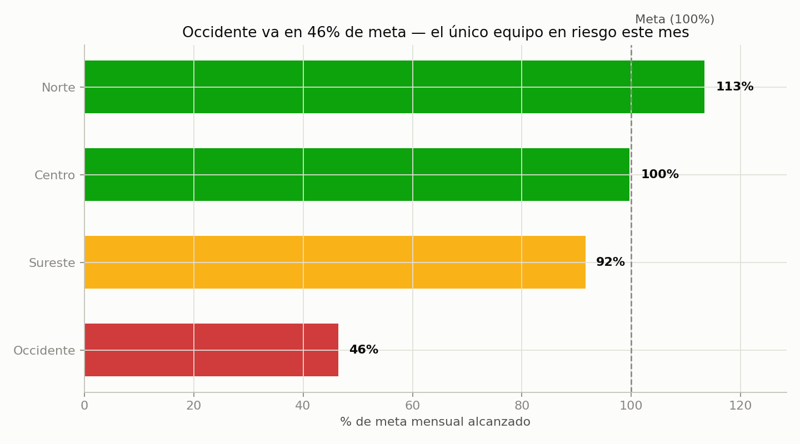

# 01 · Ventas por Equipo en Tiempo Real

**Servicio:** Micro Data Office (dashboard vivo, actualizable)
**Basado en el entregable típico de XIA:** *"Ventas por equipo, en tiempo real — dejas de esperar el cierre de mes para reaccionar."*

## El problema de negocio

Un equipo comercial con 4 regiones descubre que una de ellas viene por debajo de meta hasta que llega el reporte de cierre de mes — para entonces ya no hay margen de reacción. Cada gerente regional trae su propio Excel y la reunión se va en discutir cuál número es el correcto.

## Qué resuelve este dashboard

- Ventas acumuladas del mes vs. meta, por equipo, actualizable cada vez que se recarguen los datos.
- Tendencia de 6 meses por equipo para detectar una caída con semanas de anticipación, no al cierre.
- Un solo número de cumplimiento consolidado para la dirección; el detalle por equipo para cada gerente.
- Tabla de datos exportable debajo del gráfico — nunca solo "color" sin el número real.

## Métricas

- **Ventas totales del mes** — suma de `monto_mxn` de todas las transacciones del mes en curso, por equipo y consolidada para toda la organización.
- **Cumplimiento vs. meta** — ventas del mes ÷ meta mensual, por equipo y a nivel organización. Se clasifica en tres estados: ✅ *en meta* (≥95%), ⚠️ *cerca de meta* (80–94%), 🔴 *en riesgo* (<80%).
- **Equipo líder / equipo en riesgo** — los equipos con mayor y menor % de cumplimiento del mes, para saber a quién replicar y a quién dar seguimiento esta semana.
- **Tendencia de 6 meses** — ventas mensuales por equipo a lo largo del semestre, para distinguir una caída puntual de una tendencia sostenida (como la del equipo Occidente en los datos de ejemplo).
- **Tabla de detalle** — ventas, meta y % de cumplimiento por equipo del mes en curso, para respaldar cada número del dashboard con su cifra exacta.

## Cómo se ve



Abre `dashboard.html` en el navegador para la versión interactiva (con tooltips y tabla de datos).

## Datos

`data/generate_data.py` genera transacciones diarias sintéticas para 4 equipos (Centro, Norte, Occidente, Sureste) durante 6 meses, con una caída deliberada en el equipo Occidente a partir de julio — para poder demostrar cómo el dashboard la hace visible antes de que sea un problema de fin de trimestre.

## Stack

Python (pandas, numpy, matplotlib) para el procesamiento y el gráfico estático · HTML + Chart.js para el dashboard interactivo — sin instalar nada del lado del cliente, se abre en cualquier navegador.

## Cómo correrlo

```bash
cd projects/01-sales-performance-dashboard
python3 data/generate_data.py
python3 run_analysis.py
open dashboard.html   # o doble clic en el archivo
```

## De demo a real

En un engagement real, `data/generate_data.py` se sustituye por una conexión a la fuente real del cliente (export de CRM, Google Sheets, base de datos) — el resto del pipeline (cálculo de cumplimiento, narrativa de insights, dashboard) no cambia.
