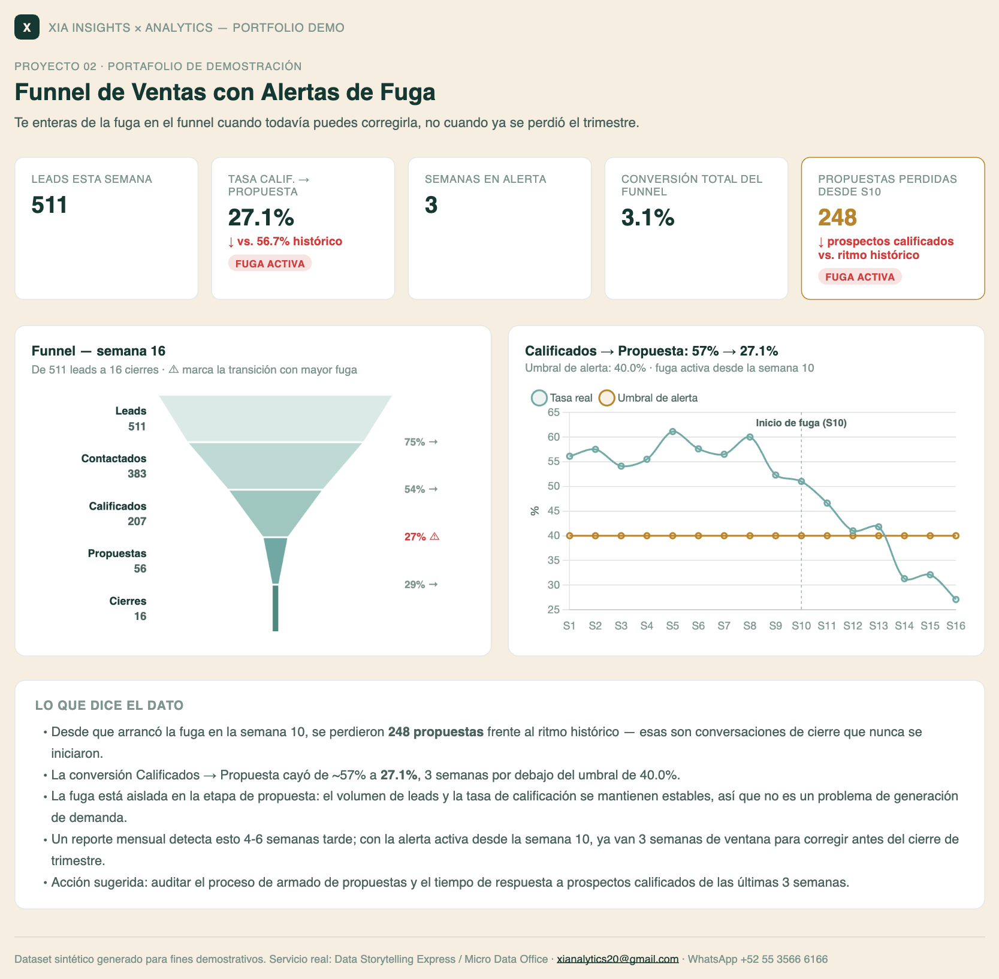

# 02 · Funnel de Ventas con Alertas de Fuga

**Servicio:** Micro Data Office (monitoreo continuo)
**Basado en el entregable típico de XIA:** *"Funnel con alertas automáticas — te enteras de la fuga cuando todavía puedes corregirla."*

## El problema de negocio

El funnel comercial tiene 5 etapas y cada una se reporta por separado, casi siempre en hojas distintas. Cuando una etapa empieza a fugar prospectos, nadie lo nota hasta que el cierre de mes llega bajo — y para entonces ya pasaron 4-6 semanas de fuga acumulada.

## Qué resuelve este dashboard

- Funnel de la semana actual como gráfica de embudo real (no barras), con la conversión etapa a etapa y la transición más débil marcada automáticamente.
- Serie de tiempo de la tasa de conversión de la etapa más crítica, con un umbral de alerta y el inicio de la fuga marcados en el mismo gráfico.
- Un contador de "semanas en alerta" para dimensionar qué tan grave y qué tan reciente es el problema.
- Impacto cuantificado de la fuga (propuestas perdidas vs. el ritmo histórico), no solo el % de caída, para que el número le hable a dirección.
- Insight explícito de dónde está la fuga (no solo que existe) para poder actuar, no solo observar.

## Métricas

- **Funnel semanal por etapa** — conteo de prospectos en cada una de las 5 etapas (Leads → Contactados → Calificados → Propuestas → Cierres) de la semana actual, con la conversión etapa a etapa (`etapa siguiente ÷ etapa actual`) rotulada junto a cada transición y la más débil marcada con ⚠.
- **Tasa Calificados → Propuesta** — `propuestas ÷ calificados` de la semana actual, comparada contra el `ALERT_THRESHOLD` (40% por defecto). Se marca como 🔴 *fuga activa* si cae por debajo del umbral, o ✅ *saludable* si se mantiene por encima.
- **Semanas en alerta** — número de semanas consecutivas (o totales) en que la tasa Calificados → Propuesta estuvo por debajo del umbral, para dimensionar qué tan grave y qué tan reciente es el problema.
- **Conversión total del funnel** — `cierres ÷ leads` de la semana actual, el número que finalmente le importa a dirección.
- **Propuestas perdidas desde el inicio de la fuga** — comparando el ritmo histórico de conversión Calificados → Propuesta (baseline pre-semana 10) contra lo realmente generado cada semana, para traducir el % de caída en prospectos calificados concretos que no llegaron a propuesta.
- **Tendencia de 16 semanas** — serie de tiempo de la tasa Calificados → Propuesta con el umbral de alerta y un marcador en la semana donde arrancó la fuga, para distinguir una caída puntual de una fuga sostenida.
- **Tabla de detalle semanal** — leads, contactados, calificados, propuestas, cierres y % Calif.→Prop. de cada una de las 16 semanas, para respaldar cada número del dashboard con su cifra exacta.

## Cómo se ve



Captura del dashboard completo — KPIs, el funnel real, la tendencia y la narrativa de insights. Abre `dashboard.html` en el navegador para la versión interactiva (con tooltips y tabla de datos).

## Datos

`data/generate_data.py` simula 16 semanas de funnel (leads → contactados → calificados → propuestas → cierres) con una fuga progresiva e intencional en la transición Calificados → Propuesta a partir de la semana 10 — el patrón típico de un problema de proceso (por ejemplo, tiempo de respuesta o calidad de propuesta) más que de generación de demanda.

## Stack

Python (pandas) para el procesamiento y el cálculo de conversión por etapa · HTML + Chart.js (y un funnel dibujado a mano en canvas) para el dashboard interactivo — sin instalar nada del lado del cliente, se abre en cualquier navegador. La captura en `assets/dashboard_preview.png` es manual (screenshot del propio `dashboard.html`), para tener una vista previa en el README sin depender de JS.

## Cómo correrlo

```bash
cd projects/02-funnel-fuga-ventas
python3 data/generate_data.py
python3 run_analysis.py
open dashboard.html
```

## De demo a real

El umbral de alerta (`ALERT_THRESHOLD` en `run_analysis.py`) se calibra con el histórico real del cliente, y el pipeline se puede programar para correr diario/semanal y enviar la alerta por correo o WhatsApp en cuanto una etapa cruza el umbral — sin esperar a la revisión mensual.
