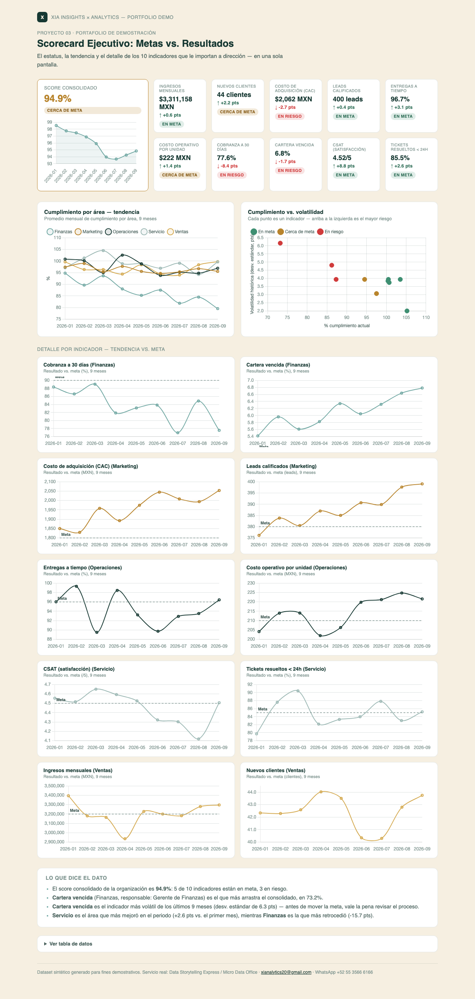

# 03 · Scorecard Ejecutivo: Metas vs. Resultados

**Servicio:** Data Storytelling Express (entregable puntual, listo para la reunión de dirección)
**Basado en el entregable típico de XIA:** *"Metas vs. resultados, sin vueltas — una pantalla, una conclusión, una acción."* y *"Un responsable claro por indicador."*

## El problema de negocio

Dirección recibe un reporte distinto de cada área (ventas, marketing, operaciones, finanzas, servicio) y la junta se va en reconciliar números en lugar de decidir. Nadie tiene, en una sola pantalla, el estatus de los 10 indicadores que realmente importan con su responsable correspondiente.

## Qué resuelve este dashboard

- Un widget único arriba a la izquierda con el score consolidado y su tendencia de 9 meses — el número que abre la reunión.
- A su lado, un tile por cada uno de los 10 indicadores (grid de 5×2) con su valor actual, movimiento vs. el mes anterior y semáforo (verde/amarillo/rojo) — sin entrar a la tabla para saber cómo va cada quien.
- Normaliza indicadores de unidades distintas (MXN, %, leads, /5) a un solo eje comparable: % de cumplimiento vs. meta.
- Tendencia de 9 meses del cumplimiento por área, para ver en qué parte del negocio mejora o se deteriora la organización.
- Dispersión de cumplimiento vs. volatilidad histórica por indicador, para distinguir un mal mes puntual de un proceso inestable.
- Drill-down: un mini-gráfico de tendencia vs. meta por cada uno de los 10 indicadores, para dar seguimiento sin salir del dashboard.
- Responsable explícito por indicador — se sabe a quién preguntar sin tener que buscarlo.

## Cómo se ve



Captura del dashboard completo — widget de score, tiles por indicador, tendencias, dispersión y el drill-down por indicador. Abre `dashboard.html` en el navegador para la versión interactiva (con tooltips y tabla de datos).

## Métricas

10 KPIs cross-funcionales, uno o dos por área, cada uno normalizado a **% de cumplimiento vs. meta** para poder compararse en el mismo eje pese a tener unidades distintas. Para indicadores donde subir es bueno, el cumplimiento es `resultado / meta`; para los que "menor es mejor" (CAC, cartera vencida, costo operativo), se invierte a `meta / resultado`, de modo que 100% siempre significa "meta alcanzada" en cualquier caso.

| Indicador | Área | Responsable | Qué mide |
|---|---|---|---|
| Ingresos mensuales | Ventas | Dir. Comercial | Facturación total del mes, en MXN. |
| Nuevos clientes | Ventas | Dir. Comercial | Clientes nuevos captados en el mes. |
| Costo de adquisición (CAC) | Marketing | Gerente de Marketing | Costo promedio en MXN para adquirir un cliente nuevo (menor es mejor). |
| Leads calificados | Marketing | Gerente de Marketing | Leads que cumplen criterio de calificación entregados a ventas. |
| Entregas a tiempo | Operaciones | Gerente de Operaciones | % de pedidos/entregas cumplidos dentro del plazo comprometido. |
| Costo operativo por unidad | Operaciones | Gerente de Operaciones | Costo promedio en MXN de operar por unidad producida/entregada (menor es mejor). |
| Cobranza a 30 días | Finanzas | Gerente de Finanzas | % de cartera cobrada dentro de los primeros 30 días. |
| Cartera vencida | Finanzas | Gerente de Finanzas | % de cartera con pagos vencidos (menor es mejor). |
| CSAT (satisfacción) | Servicio | Gerente de Servicio | Satisfacción promedio del cliente en escala de 1 a 5. |
| Tickets resueltos < 24h | Servicio | Gerente de Servicio | % de tickets de soporte cerrados en menos de 24 horas. |

El **score consolidado** que se ve en la tendencia es el promedio simple del % de cumplimiento de los 10 indicadores; el **cumplimiento por área** es el mismo promedio agrupado por Ventas/Marketing/Operaciones/Finanzas/Servicio.

## Datos

`data/generate_data.py` genera un histórico sintético de 9 meses para cada uno de los 10 KPIs (`data/kpi_historico.csv`), con sesgos realistas (algunos por encima de meta, otros por debajo) y una deriva mes a mes hacia ese sesgo, no una línea recta. El snapshot del mes actual (`data/scorecard.csv`) es simplemente el último mes de ese histórico, para que el tile, el gráfico de tendencia y la tabla siempre cuadren entre sí.

`run_analysis.py` deriva de ahí todo lo demás: % de cumplimiento por indicador y por mes, volatilidad (desviación estándar del cumplimiento en 9 meses) y el promedio mensual por área.

## Stack

Python (pandas, numpy) para el procesamiento · HTML + Chart.js para el dashboard interactivo — sin instalar nada del lado del cliente, se abre en cualquier navegador. La captura en `assets/dashboard_preview.png` es manual (screenshot del propio `dashboard.html`), para tener una vista previa en el README sin depender de JS.

## Cómo correrlo

```bash
cd projects/03-scorecard-metas-vs-resultados
python3 data/generate_data.py
python3 run_analysis.py
open dashboard.html
```

## De demo a real

Este es el formato típico de la primera entrega de un diagnóstico XIA: se arma en días a partir de los reportes que el cliente ya tiene (Excel, CRM, ERP), normalizando todo a un solo criterio de cumplimiento para que la conversación de dirección sea sobre qué hacer, no sobre qué número creer.
