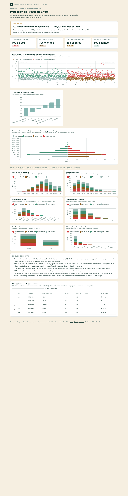

# 04 · Predicción de Riesgo de Churn

**Servicio:** Micro Data Office (proyecto analítico avanzado dentro de la suscripción)
**Conecta con:** *"Sabes que algo bajó, pero no por qué ni qué hacer al respecto"* → aquí sí se sabe qué cliente y por qué.

## El problema de negocio

Un negocio de suscripción/membresía detecta la cancelación de un cliente hasta que ya canceló. Para entonces no hay nada que hacer. El equipo comercial no tiene forma de priorizar a quién llamar esta semana entre cientos de cuentas activas — y un dashboard analítico de "aquí está el riesgo de cada quién" tampoco resuelve eso: sigue siendo trabajo del lector convertirlo en un plan.

## Diseñado para planeación semanal, no para control de alto nivel

El dashboard sigue el **principio de la pirámide de Minto**: la respuesta primero, la evidencia después.

1. **La respuesta (banner, arriba de todo):** cuántas llamadas hay que hacer esta semana, cuánto ingreso está en juego, y por dónde empezar — sin tener que leer ni un gráfico.
2. **La agrupación MECE (KPIs + plan de llamadas):** la cartera activa se divide en 4 grupos que no se traslapan y cubren a todos los clientes, cada uno con una cadencia distinta — no todos requieren la misma urgencia:

   | Grupo | Perfil | Cadencia | Acción |
   |---|---|---|---|
   | 🔴 Rescate prioritario | Alto riesgo, alto gasto | **Semanal** | Llamada de retención, repartida en un plan de 5 días con checkboxes de seguimiento |
   | 🟤 Riesgo menor | Alto riesgo, bajo gasto | **Semanal (automatizado)** | Campaña de email/WhatsApp — mismo costo para 1 cliente que para todos |
   | 🟢 Clientes ancla | Bajo riesgo, alto gasto | **Mensual** | Upsell / plan anual — la cartera más valiosa, no solo "sin riesgo" |
   | ⚪ Base estable | Bajo riesgo, bajo gasto | **Mensual** | Monitoreo pasivo |

3. **La evidencia (matriz, importancia de variables, pirámide, histogramas):** por qué el plan es ese y no otro — demotada al fondo de la página, bajo un encabezado explícito de "revisión mensual, no semanal".

## Plan de llamadas: seguimiento diario real

"Rescate prioritario" son ~295 clientes — más de lo que un equipo puede llamar en una semana. El dashboard asume una **capacidad explícita (20 llamadas/día, 5 días)**, prioriza por gasto mensual dentro del cuadrante (proteger primero el ingreso más grande) y manda el resto a un backlog visible para la próxima semana, en vez de fingir que todo se atiende hoy.

La tabla resultante tiene un checkbox por cliente y una barra de progreso ("X / 100 contactados"). Se marca al contactar a cada cliente y el estado **se guarda en `localStorage` del navegador** — sin backend — así que sigue marcado la próxima vez que se abra `dashboard.html`, incluso día a día durante la semana.

## Cómo se ve



*(Captura recortada a 5 filas del plan de llamadas — la versión real trae las 100 de la semana.)*

Abre `dashboard.html`: arriba está el banner de la semana y los KPIs; más abajo, como evidencia de soporte, la matriz interactiva, la pirámide de cartera y los histogramas por variable (sección "Revisión mensual"); al final, el plan de llamadas completo con checkboxes.

## Datos y metodología

`data/generate_data.py` genera 1,200 clientes sintéticos de tipo suscripción con antigüedad, gasto, tickets de soporte, actividad reciente y tipo de contrato, y una etiqueta histórica de churn generada a partir de un modelo latente realista (más días sin actividad, más tickets y contrato mensual aumentan el riesgo; más antigüedad y mayor uso del producto lo reducen).

`run_analysis.py` entrena una regresión logística (scikit-learn) sobre el 75% de los datos, valida AUC en el 25% restante, y aplica el score a toda la cartera. Como la tasa base de churn es baja, la probabilidad cruda queda comprimida cerca de 0 con una cola larga — la matriz usa el **percentil de riesgo dentro de la cartera** (0-100) en vez de la probabilidad cruda, para que los 4 cuadrantes queden balanceados y el scatter sea legible; la probabilidad real se mantiene en la tabla y el tooltip.

## Métricas del dashboard

- **Llamadas esta semana:** clientes de "Rescate prioritario" que caben en la capacidad semanal definida (100 de los ~295 totales) — el numerador es lo operativamente realista, no todo el cuadrante.
- **Cola automatizada:** clientes en "Riesgo menor" — no se cuentan como pendientes del equipo comercial porque su acción es una campaña automatizada, no una llamada.
- **Backlog próxima semana:** clientes de "Rescate prioritario" que no caben esta semana — visibilidad explícita de que el trabajo no termina el viernes, en vez de ocultarlo.
- **Sin acción esta semana:** clientes ancla + base estable — bajo riesgo, revisión mensual en vez de semanal.
- **AUC del modelo (test)** (visible en la sección de revisión mensual, no en los KPIs semanales): capacidad del modelo para distinguir clientes que cancelan de los que no, medida sobre el 25% de datos que no vio durante el entrenamiento. Va de 0.5 (equivalente a adivinar) a 1.0 (separación perfecta); se considera saludable a partir de 0.75. Es una métrica de salud del modelo, no de trabajo semanal — de ahí que esté deliberadamente fuera de la vista operativa.

## Stack

Python (pandas, scikit-learn) + HTML/Chart.js (con `localStorage` para el seguimiento del checklist). `assets/dashboard_preview.png` es una captura manual de `dashboard.html`, no la genera `run_analysis.py`.

## Cómo correrlo

```bash
cd projects/04-prediccion-churn
python3 data/generate_data.py
python3 run_analysis.py
open dashboard.html
```

## De demo a real

Con datos reales del cliente (CRM + facturación + tickets de soporte) el mismo pipeline entrena sobre el histórico real, y el score de riesgo se recalcula semanalmente. La capacidad de llamadas (`CAPACIDAD_POR_DIA`, `DIAS` en `run_analysis.py`) es el único parámetro que un cliente real necesita ajustar a su propio equipo; el checklist con checkboxes es una maqueta de lo que en producción sería una vista conectada al CRM (para que "contactado" quede registrado ahí, no solo en el navegador de quien abrió el dashboard).
