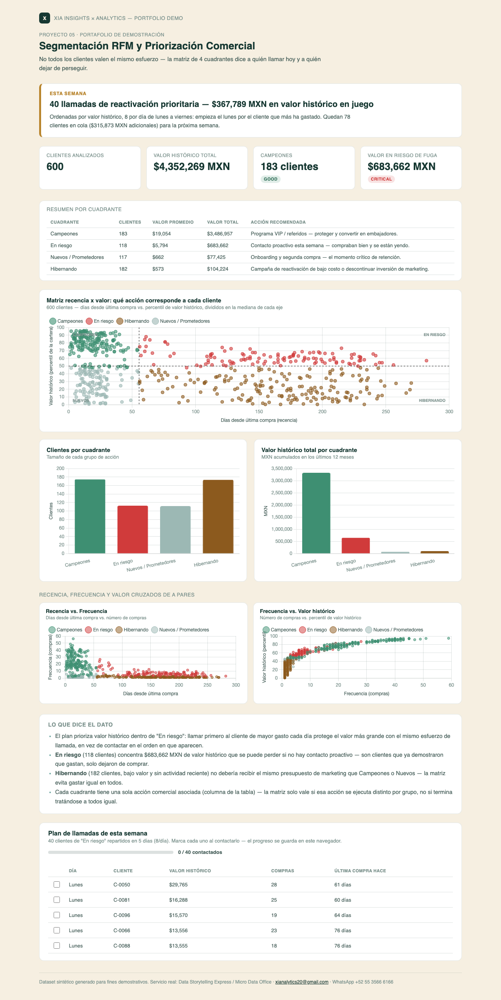

# 05 · Segmentación RFM y Priorización Comercial

**Servicio:** Data Storytelling Express
**Conecta con:** una sola fuente confiable para decidir dónde poner el esfuerzo comercial, en vez de tratar a todos los clientes igual.

## El problema de negocio

El equipo comercial y de marketing invierte el mismo esfuerzo (y presupuesto) en todos los clientes, sin distinguir entre quién compra seguido y mucho, quién dejó de comprar, y quién es nuevo. El resultado: se gasta en reactivar clientes hibernando de bajo valor mientras un cliente "en riesgo" de alto valor se va sin que nadie lo note.

## Qué resuelve este dashboard

- Calcula Recencia y Valor histórico (RFM simplificado) por cliente a partir del historial de transacciones.
- Cruza ambas variables en una **matriz de 4 cuadrantes** (scatter interactivo) en vez de una tabla de segmentos que hay que interpretar caso por caso.
- Asigna una acción comercial específica por cuadrante — la segmentación solo sirve si cambia lo que se hace con cada grupo.
- Arma un plan de llamadas de la semana para el cuadrante "En riesgo", priorizado por valor histórico, con checklist de seguimiento.

## Métricas

Por cada cliente se calculan dos variables a partir de su historial de transacciones, que forman los dos ejes de la matriz:

- **Recencia:** días transcurridos desde la última compra. Eje X del scatter — a la izquierda, clientes recientes; a la derecha, clientes inactivos.
- **Valor histórico:** suma del monto gastado en los últimos 12 meses. Eje Y del scatter, expresado como percentil dentro de la cartera (el monto crudo tiene cola larga y aplasta el gráfico) — el monto real en MXN se muestra en el tooltip y la tabla.

Cada eje se corta en su mediana, lo que arma 4 cuadrantes balanceados y cada uno recibe una acción comercial distinta:

| Cuadrante | Recencia | Valor | Acción |
|---|---|---|---|
| **Campeones** | Reciente | Alto | Programa VIP / referidos |
| **En riesgo** | Inactivo | Alto | Contacto proactivo esta semana |
| **Nuevos / Prometedores** | Reciente | Bajo | Onboarding y segunda compra |
| **Hibernando** | Inactivo | Bajo | Reactivación de bajo costo o descontinuar inversión |

## Cómo se ve



Captura del dashboard completo — resumen por cuadrante, matriz recencia x valor, scatters R x F y F x valor, e insights. Abre `dashboard.html` en el navegador para la versión interactiva (con tooltips y el plan de llamadas completo).

## Datos

`data/generate_data.py` genera 12 meses de transacciones para 600 clientes sintéticos con 6 perfiles de comportamiento distintos (incluyendo clientes que compraban bien y dejaron de comprar, simulando el segmento "En riesgo" de forma realista).

## Stack

Python (pandas, numpy) para el cálculo de RFM y cuadrantes · HTML + Chart.js para el dashboard interactivo — sin instalar nada del lado del cliente, se abre en cualquier navegador. La captura en `assets/dashboard_preview.png` es manual (screenshot del propio `dashboard.html`, con la tabla de llamadas cortada a 5 filas), para tener una vista previa en el README sin depender de JS.

## Cómo correrlo

```bash
cd projects/05-segmentacion-rfm
python3 data/generate_data.py
python3 run_analysis.py
open dashboard.html
```

## De demo a real

Con el historial de ventas real del cliente (POS, e-commerce o CRM) el mismo cálculo corre directo — RFM no necesita modelos complejos, solo una fuente de transacciones limpia, que es justo lo que un engagement de Micro Data Office deja resuelto de fondo.
