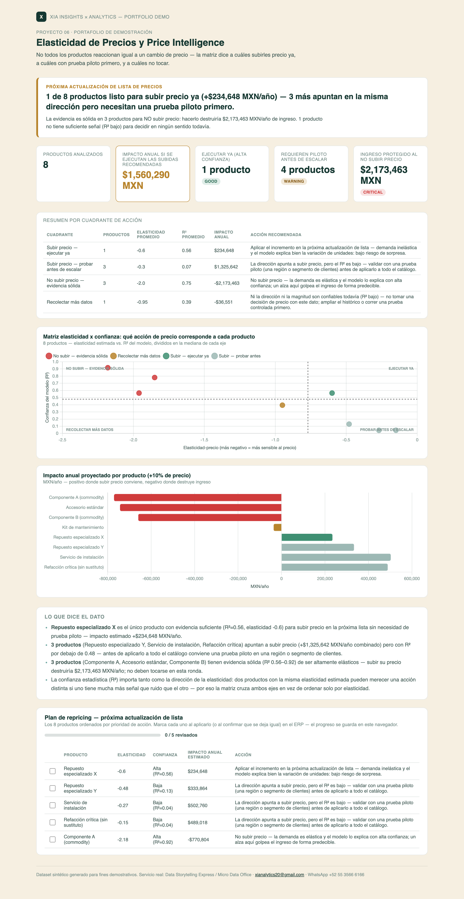

# 06 · Elasticidad de Precios y Price Intelligence

**Servicio:** Micro Data Office (proyecto analítico avanzado)
**Aplica a:** manufactura, distribución, retail B2B — cualquier negocio con catálogo de productos y decisiones de lista de precios.

## El problema de negocio

Las decisiones de precio suelen tomarse por instinto o por regla pareja ("subimos todo 5% este trimestre") sin saber qué productos son sensibles al precio y cuáles no. Subir precio a un producto de demanda elástica destruye ingreso; no subirlo a uno inelástico deja dinero sobre la mesa.

## Qué resuelve este dashboard

- Estima la elasticidad-precio real de cada producto con una regresión log-log sobre el histórico de precio y volumen.
- Cruza esa elasticidad con la confianza estadística de la estimación (R²) en una **matriz de 4 cuadrantes** — no basta con saber la dirección del efecto, hay que saber qué tan seguro se puede estar de él antes de tocar la lista de precios.
- Asigna una acción de precio distinta a cada cuadrante: subir ya, subir con prueba piloto, no subir, o recolectar más datos.
- Proyecta el impacto en ingreso (MXN/año, no solo %) de cada acción, y arma un plan de repricing accionable con checklist por producto.

## Cómo se ve



Abre `dashboard.html` para la versión interactiva.

## Métricas

Por cada producto se calculan cuatro variables a partir de su historial de precio y volumen:

- **Elasticidad-precio:** coeficiente `b` de la regresión `ln(unidades) = a + b·ln(precio)`. Indica el % de cambio en unidades vendidas ante un 1% de cambio en precio. Un valor más negativo (ej. -2.1) significa demanda elástica — muy sensible al precio; un valor cercano a 0 (ej. -0.15) significa demanda inelástica — poco sensible al precio. Eje X de la matriz.
- **Confianza del modelo (R²):** qué tan bien explica el precio la variación en unidades vendidas frente al ruido semanal, en la misma regresión. Dos productos con la misma elasticidad estimada pueden merecer una acción distinta si uno tiene mucha más señal que ruido que el otro. Eje Y de la matriz.
- **Impacto anual (+10%):** cambio proyectado en el ingreso (MXN/año) si el precio sube 10%, combinando el aumento de precio con el cambio de volumen que predice la elasticidad estimada. Es la métrica que realmente importa para decidir, porque una elasticidad negativa no siempre implica pérdida de ingreso.
- **Cuadrante / acción recomendada:** cruce de elasticidad y R² contra la mediana de cada eje — "Subir precio — ejecutar ya" (inelástico + alta confianza), "Subir precio — probar antes de escalar" (inelástico + baja confianza), "No subir precio — evidencia sólida" (elástico + alta confianza), o "Recolectar más datos" (elástico + baja confianza).

## Datos y metodología

`data/generate_data.py` simula 52 semanas de precio y unidades vendidas para 8 productos con elasticidades "reales" distintas (de -2.1 a -0.15) y cambios de precio periódicos, para que el efecto sea recuperable estadísticamente — tal como ocurre con datos reales de ERP/POS.

`run_analysis.py` ajusta `ln(unidades) = a + b·ln(precio)` por producto (el coeficiente `b` es la elasticidad, el R² del ajuste es la confianza), cruza ambos ejes en la mediana para armar los 4 cuadrantes de acción, y proyecta el impacto anual en ingreso de un +10% de precio usando la elasticidad estimada de cada producto.

## Stack

Python (pandas, numpy) para el cálculo de elasticidad y cuadrantes · HTML + Chart.js para el dashboard interactivo — sin instalar nada del lado del cliente, se abre en cualquier navegador. La captura en `assets/dashboard_preview.png` es manual (screenshot del propio `dashboard.html`, con la tabla del plan de repricing cortada a 5 filas), para tener una vista previa en el README sin depender de JS.

## Cómo correrlo

```bash
cd projects/06-elasticidad-precios
python3 data/generate_data.py
python3 run_analysis.py
open dashboard.html
```

## De demo a real

Este análisis es replicable con el histórico de precio/venta que ya vive en el ERP o POS del cliente — el mismo trabajo que Diego desarrolló construyendo el Centro de Excelencia de Sales Analytics y Pricing Intelligence LATAM en la industria industrial.
