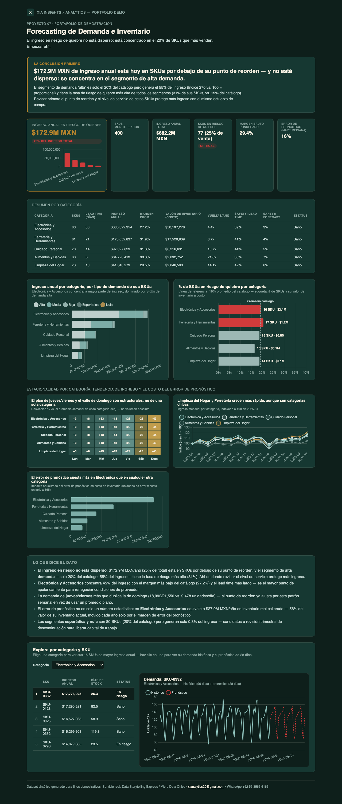

# 07 · Forecasting de Demanda e Inventario

**Servicio:** Micro Data Office (dashboard vivo, se actualiza con cada corte de inventario)
**Aplica a:** distribución, retail, manufactura — cualquier negocio que compra o produce con anticipación.

## El problema de negocio

El inventario se revisa "a ojo" o hasta que ya hubo un quiebre de stock que canceló una venta. Nadie separa cuánto de la demanda es tendencia real vs. ruido del día a día, y el punto de reorden (si existe) suele ser una regla arbitraria ("pedir cuando quede poco") en vez de estar calculado con el lead time real del proveedor.

## Qué resuelve este dashboard

- Descompone la demanda diaria en tendencia y estacionalidad semanal por SKU (los jueves/viernes no son iguales a los domingos, y el modelo lo respeta).
- Proyecta la demanda de los próximos 28 días por SKU.
- Calcula el punto de reorden real: demanda esperada durante el lead time del proveedor + stock de seguridad basado en la variabilidad histórica (no un margen arbitrario).
- Señala qué SKUs están hoy por debajo de su punto de reorden — antes de que se conviertan en una venta perdida.
- Incluye un explorador interactivo: elige una categoría, ve sus 15 SKUs de mayor ingreso anual, y haz clic en uno para ver su demanda histórica y el pronóstico de 28 días.

## Métricas

Por cada SKU se calculan, a partir de su historial diario de ventas:

- **Demanda diaria promedio:** nivel de la tendencia (promedio móvil de 14 días, centrado) sobre las últimas dos semanas de historia — la venta "de fondo" sin el ruido día a día.
- **Índice estacional por día de la semana:** razón entre venta real y tendencia, promediada por día de la semana (lun-dom). Captura que jueves/viernes venden distinto que domingo, y se usa para proyectar la demanda de los próximos 28 días.
- **Días de stock:** stock actual ÷ demanda diaria promedio. Cuántos días dura el inventario si la venta sigue al ritmo actual, sin reabasto.
- **Punto de reorden:** demanda esperada durante el lead time del proveedor + stock de seguridad (`Z=1.65`, ~95% de nivel de servicio, escalado por la desviación estándar de la demanda de los últimos 90 días y la raíz del lead time). Es el umbral de stock por debajo del cual hay que pedir ya.
- **SKU en riesgo:** stock actual por debajo de su punto de reorden — señal de quiebre de stock antes del próximo reabasto.

## Cómo se ve



Abre `dashboard.html` para la versión interactiva con los 400 SKUs.

## Datos

`data/generate_data.py` simula 18 meses de demanda diaria para 400 SKUs repartidos en 5 categorías (Alimentos y Bebidas, Limpieza del Hogar, Cuidado Personal, Ferretería y Herramientas, Electrónica y Accesorios), cada una con su propio lead time — se asume que cada categoría la surte un solo proveedor. La mezcla de volumen es 20% demanda alta, 40% media, 20% baja, 15% esporádica y 5% nula, calibrada para que ~320 SKUs queden sanos y ~80 en riesgo — el tipo de mezcla real que aparece en cualquier catálogo. Cada SKU también trae costo y precio unitario: el costo varía dentro de su categoría sin superar 2.5 desviaciones estándar del promedio de esa categoría, y el margen (precio vs. costo) se sortea entre 10% y 45%.

## Stack

Python (pandas, numpy) para el cálculo de pronóstico, punto de reorden y salud de inventario · HTML + Chart.js para el dashboard interactivo — sin instalar nada del lado del cliente, se abre en cualquier navegador. El pronóstico usa descomposición de tendencia + estacionalidad hecha a mano (sin librerías de forecasting pesadas) para que el método sea transparente y fácil de explicarle a un cliente no técnico. La captura en `assets/dashboard_preview.png` es manual (screenshot del propio `dashboard.html`, con la tabla del explorador cortada a 5 filas), para tener una vista previa en el README sin depender de JS.

## Cómo correrlo

```bash
cd projects/07-forecast-demanda-inventario
python3 data/generate_data.py
python3 run_analysis.py
open dashboard.html
```

## De demo a real

Con el histórico de ventas/salidas de almacén del cliente (ERP, WMS o incluso Excel) y el lead time real de cada proveedor, este mismo cálculo corre directo y se puede recalcular en cada corte de inventario.
