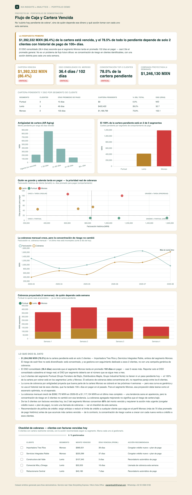

# 08 · Flujo de Caja y Cartera Vencida (AR Aging)

**Servicio:** Data Storytelling Express / Micro Data Office
**Aplica a:** cualquier negocio B2B que factura a crédito — y también a la gestión financiera de comunidades/condominios que Diego ha llevado directamente.

## El problema de negocio

Finanzas sabe cuánto hay pendiente de cobrar, pero no cuánto de eso realmente va a entrar en las próximas semanas ni qué tan grave es la mora por cliente. El resultado: proyecciones de flujo de caja optimistas que no se cumplen, y llamadas de cobranza que llegan tarde o al cliente equivocado.

## Qué resuelve este dashboard

- Clasifica la cartera pendiente en buckets de antigüedad (vigente, 1-30, 31-60, 61-90, 90+ días).
- Segmenta a los clientes por comportamiento de pago real (Puntual / Lento / Moroso) — calculado de su propio historial, no de una etiqueta impuesta — y cruza esa segmentación con el DSO, la cartera pendiente y la proyección de cobranza.
- Calcula el DSO consolidado y por segmento, para que un promedio saludable no esconda a los clientes que de verdad tardan en pagar.
- Proyecta el flujo de cobranza de las próximas 4 semanas por segmento, usando una curva de probabilidad de cobro distinta por antigüedad — no asume que toda la cartera se cobra igual de rápido, ni que le toca a todos los clientes por igual.
- Arma una matriz de riesgo (tamaño del cliente x días promedio de pago) para distinguir quién es grande y además tarda en pagar — la prioridad real de cobranza — de quién es chico o puntual.
- Entrega un checklist de cobranza priorizado con la acción recomendada por cliente (llamada, recordatorio automático, o congelar crédito nuevo).

## Métricas

- **Antigüedad de cartera (AR Aging)** — monto pendiente agrupado en 5 buckets según días de vencimiento: vigente (no vencida), 1-30, 31-60, 61-90 y 90+ días.
- **Segmento de comportamiento de pago** — Puntual (<20 días promedio para pagar), Lento (20-70 días) o Moroso (>70 días), calculado del historial de pagos de cada cliente, no de una etiqueta del generador de datos.
- **Cartera vencida** — suma del monto pendiente con días vencidos > 0, y su % sobre la cartera pendiente total. Se marca 🔴 crítica si supera 35%, ⚠️ en alerta si supera 20%, ✅ sana si no.
- **DSO consolidado y por segmento (Days Sales Outstanding)** — cartera pendiente ÷ ventas facturadas en los últimos 90 días × 90, calculado para toda la cartera y también cortado por segmento, para exponer cuánto esconde el promedio consolidado.
- **Concentración de riesgo (top-2 clientes)** — % de la cartera pendiente que está en manos de los 2 clientes con mayor monto, para distinguir un riesgo diversificado de uno concentrado en pocos nombres.
- **Cobranza proyectada (próximas 4 semanas) por segmento** — cada bucket de antigüedad se distribuye semana a semana usando una curva de probabilidad de cobro propia (a mayor antigüedad, menor probabilidad de cobrarse pronto), desglosada por segmento para mostrar de quién depende cada semana de flujo de caja.
- **Matriz de riesgo** — facturación histórica del cliente (tamaño) vs. días promedio para pagar (comportamiento), coloreada por segmento, para priorizar a quien es grande y además tarda en pagar.
- **Checklist de cobranza** — clientes con facturas realmente vencidas hoy, con la acción recomendada según su segmento (congelar crédito, llamada de cobranza o recordatorio automático).

## Preguntas que responde (metodología Minto — la respuesta primero)

1. ¿Cuánto de la cartera pendiente es realmente riesgo, y de quién? → banner + cartera vencida + cartera pendiente por segmento.
2. ¿Qué tan concentrado está ese riesgo entre clientes? → concentración top-2 clientes + matriz de riesgo.
3. ¿El DSO consolidado refleja la realidad de todos los clientes? → DSO consolidado vs. DSO por segmento.
4. ¿Cuánto se va a cobrar en las próximas 4 semanas, y de quién depende? → proyección de cobranza por segmento.
5. ¿La cobranza está mejorando en general, o solo lo parece? → serie mensual de facturación vs. cobranza (con el mes en curso marcado como incompleto).
6. ¿A qué clientes hay que llamar esta semana, y con qué acción? → matriz de riesgo + checklist de cobranza priorizado.
7. ¿Qué cambiar en la política de crédito para que esto no se repita? → recomendación final en "Lo que dice el dato".

## Cómo se ve



Captura del dashboard completo — banner con la respuesta primero, KPIs, tabla por segmento, las gráficas y el checklist de cobranza. Abre `dashboard.html` en el navegador para la versión interactiva.

## Datos

`data/generate_data.py` genera facturas sintéticas para 8 clientes con tres perfiles de pago (puntual, lento, moroso), de forma que la cartera pendiente que queda en el sistema esté realista y deliberadamente concentrada en los clientes más problemáticos — como suele pasar en la vida real.

## Stack

Python (pandas, numpy) para el cálculo de segmentación, DSO y proyección de cobranza · HTML + Chart.js para el dashboard interactivo — sin instalar nada del lado del cliente, se abre en cualquier navegador. La captura en `assets/dashboard_preview.png` es manual (screenshot del propio `dashboard.html`), para tener una vista previa en el README sin depender de JS.

## Cómo correrlo

```bash
cd projects/08-flujo-caja-cartera
python3 data/generate_data.py
python3 run_analysis.py
open dashboard.html
```

## De demo a real

Con el reporte de cuentas por cobrar del cliente (la mayoría de los ERPs y sistemas contables lo exportan a Excel) este análisis corre directo, y la curva de cobranza por antigüedad se calibra con el historial real de pagos del negocio en vez de la curva genérica usada aquí. Los cortes de segmento (Puntual <20 días, Lento 20-70, Moroso >70) también se ajustan a la distribución real de días de pago del negocio en cuestión, en vez de los umbrales usados aquí.
