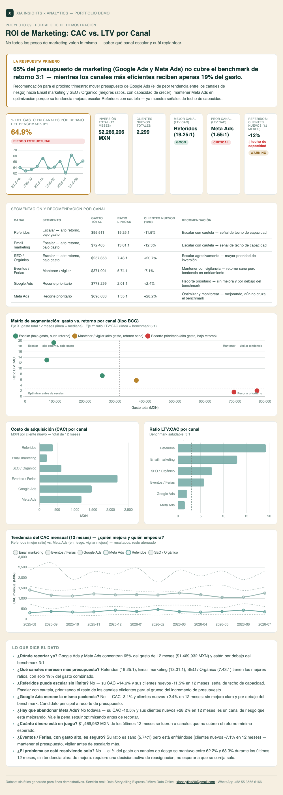

# 09 · ROI de Marketing: CAC vs. LTV por Canal

**Servicio:** Data Storytelling Express
**Aplica a:** cualquier negocio que invierte en más de un canal de adquisición (ads, orgánico, referidos, eventos) y reparte presupuesto sin comparar el retorno real.

## El problema de negocio

Marketing reporta "leads generados" o "gasto invertido" por canal, pero rara vez se compara el costo de adquisición (CAC) contra el valor real que ese cliente deja en el tiempo (LTV). El resultado: se sigue invirtiendo fuerte en el canal más visible, no en el más rentable.

## Qué resuelve este dashboard

- Calcula CAC real por canal a partir del gasto y los clientes efectivamente adquiridos.
- Estima LTV usando retención observada y margen bruto — no un supuesto optimista.
- Compara cada canal contra un benchmark saludable de LTV:CAC (3:1) para decidir escalar, mantener o replantear.
- Segmenta los 6 canales en una matriz tipo BCG (gasto vs. retorno) para ver de un vistazo dónde escalar, mantener, optimizar o recortar.
- Analiza la tendencia de 12 meses de CAC y clientes nuevos por canal, para distinguir un canal que se está deteriorando de uno que ya está mejorando (aunque hoy esté por debajo del benchmark).
- Sigue la metodología de la pirámide de Minto: la recomendación de asignación de presupuesto va primero (banner), la evidencia (segmentación, tendencia, tabla por canal) después.

## Métricas

- **CAC (Costo de Adquisición de Cliente)** — gasto total del canal en el periodo ÷ clientes nuevos efectivamente adquiridos por ese canal. Es el costo real por cliente, no el costo por lead o por clic.
- **LTV (Lifetime Value) estimado** — ticket promedio × margen bruto × meses de retención promedio del canal. Usa retención observada, no una proyección optimista de vida del cliente, para que el ratio resultante sea conservador.
- **Ratio LTV:CAC** — LTV ÷ CAC. Es el indicador central del dashboard: compara cuánto vale un cliente contra cuánto costó adquirirlo, y se contrasta contra un benchmark saludable de 3:1 (por debajo, el canal no se paga a sí mismo con margen suficiente).
- **Payback (meses)** — CAC ÷ (ticket promedio × margen bruto). Cuántos meses de compras le toma a un cliente nuevo cubrir lo que costó adquirirlo, sin considerar aún el resto de su retención.
- **Segmentación tipo BCG (gasto vs. retorno)** — cada canal se ubica en una matriz de gasto total (alto/bajo vs. la mediana de los 6 canales) contra ratio LTV:CAC (saludable/riesgo vs. el benchmark 3:1), para separar "escalar" (bajo gasto, buen retorno) de "recorte prioritario" (alto gasto, bajo retorno).
- **Tendencia de 12 meses (CAC y clientes nuevos)** — variación % del CAC mensual y de los clientes nuevos entre el primer y el último mes de cada canal, para detectar si un canal de bajo riesgo empieza a mostrar techo de capacidad, o si un canal de riesgo ya está mejorando.
- **Recomendación por canal** — combina el segmento (gasto vs. retorno) con la tendencia: un canal "de riesgo" que mejora rápido (ej. más clientes nuevos) se marca para optimizar y monitorear, no para recorte inmediato; un canal "saludable" con clientes nuevos cayendo se marca para escalar con cautela por posible techo de capacidad.
- **% del gasto en canales de riesgo** — suma del gasto total de los canales cuyo ratio LTV:CAC está por debajo del benchmark de 3:1, sobre el gasto total — y su evolución mes a mes, para ver si el problema se está corrigiendo solo o requiere una decisión activa de reasignación.

## Cómo se ve



Captura del dashboard completo — banner con la respuesta primero, KPIs, tabla de segmentación por canal, matriz tipo BCG, tendencia de CAC y los insights. Abre `dashboard.html` en el navegador para la versión interactiva.

## Datos

`data/generate_data.py` simula 12 meses de gasto y clientes adquiridos para 6 canales (Referidos, SEO, Google Ads, Meta Ads, Email, Eventos) con retención y ticket promedio distintos por canal — para que el resultado no sea "más gasto = peor" de forma trivial, sino que dependa de la calidad real del cliente que trae cada canal.

## Stack

Python (pandas, numpy) para el cálculo de CAC, LTV, segmentación y tendencia · HTML + Chart.js para el dashboard interactivo — sin instalar nada del lado del cliente, se abre en cualquier navegador. La captura en `assets/dashboard_preview.png` es manual (screenshot del propio `dashboard.html`), para tener una vista previa en el README sin depender de JS.

## Cómo correrlo

```bash
cd projects/09-roi-marketing-canal
python3 data/generate_data.py
python3 run_analysis.py
open dashboard.html
```

## De demo a real

Con los reportes de gasto de cada plataforma (Google Ads, Meta Ads Manager, CRM) y el histórico de compras del cliente, el CAC y LTV se calculan con datos reales en vez de supuestos — el resto del análisis no cambia.
