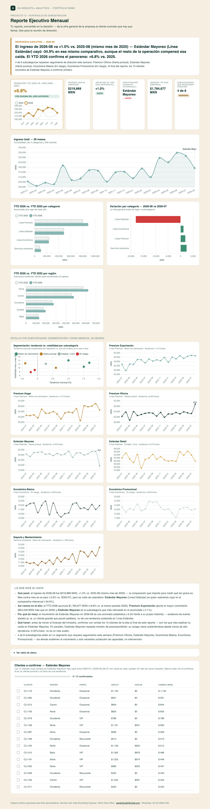

# 10 · Reporte Ejecutivo Mensual

**Servicio:** Data Storytelling Express — este es el entregable insignia del servicio, tal cual se describe en la propuesta de valor de XIA.
**Frase que resume el servicio:** *"Tu reporte, convertido en la decisión — a tiempo para tomarla."*

## El problema de negocio

El reporte mensual llega como una tabla de números. Dirección ve que el ingreso bajó, pero no por qué, y para averiguarlo hay que pedirle a alguien que "le meta mano" al Excel — para cuando hay respuesta, ya pasó la semana en la que importaba.

## Qué resuelve este reporte

El dashboard está diseñado con la pirámide de Minto (la respuesta va primero, en el banner superior) y como un embudo de detalle: cifras generales de la empresa arriba, bajando por categoría, región y subcategoría, hasta el nivel de cliente al final — nunca al revés. Nadie tiene que llegar a la fila 40 de una tabla para entender qué pasó, pero quien necesita el detalle lo encuentra sin salir del reporte:

1. **La empresa** — qué pasó este mes, comparado contra el **mismo mes del año anterior** (no contra el mes inmediato anterior, que mezcla estacionalidad con la señal real), y cómo va el año (YTD) contra el mismo periodo del año anterior — el YTD es el contraste que dice qué tan grave es: si el mes cae pero el año sigue sano, el problema está concentrado, no generalizado.
2. **Categoría y región** — los cortes generales: qué categoría y qué región explican el movimiento, antes de bajar a producto.
3. **Subcategoría** — qué subcategoría lo explica con precisión, en qué segmento de desempeño cae cada una (motor de crecimiento, estable, en riesgo, alerta puntual) y qué estrategia aplica.
4. **Si la caída es un evento aislado** o el inicio de una tendencia sostenida (la señal que separa ambos casos).
5. **Cliente** — el nivel más granular: la lista concreta de clientes de la subcategoría causante a confirmar esta semana, priorizados por el tamaño de su caída.

## Cómo se ve



Abre `dashboard.html` para la versión interactiva — pensada para proyectarse en una reunión ejecutiva de 15 minutos.

## Datos

`data/generate_data.py` simula una cartera comercial completa, no solo una serie de ingreso por categoría:

- **200 clientes** repartidos en **5 regiones** (Norte 38%, Centro 30%, Occidente 15%, Sureste 12%, Bajío 5%).
- **4 perfiles de cliente** por volumen y frecuencia de compra — VIP (alto volumen/alta frecuencia), Recurrente (bajo volumen/alta frecuencia), Ocasional (alto volumen/baja frecuencia) y Esporádico (bajo volumen/baja frecuencia) — asignados de forma independiente a la región de cada cliente.
- **4 categorías → 8 subcategorías** (1 a 3 por categoría). Cada cliente solo tiene activas entre 1 y 8 subcategorías (según su perfil): no todos compran todos los productos, igual que en una cartera real.
- **~8,500 transacciones mensuales** resultantes de cruzar cliente × subcategoría × mes, con una caída aislada y explicable en una sola subcategoría el último mes — el patrón real más común (un cliente grande que pausa pedidos) frente al que un promedio general no dice nada.

La tendencia mensual ya no es un parámetro fijo por categoría: se define a nivel **subcategoría-cliente** (la base de la subcategoría más el ruido propio de cada cliente), y el ingreso de cada categoría emerge de agregar esas series individuales hacia arriba — igual que en un negocio real, donde la tendencia de una línea de producto es la suma de lo que hace cada cliente, no un número que alguien decide de antemano. `run_analysis.py` recalcula tendencia, volatilidad y anomalía desde esos datos agregados por regresión; no las lee del generador.

`region` y `perfil` ya alimentan el dashboard: `region` arma el corte de ingreso YTD por región, y `perfil` etiqueta a cada cliente en la lista de confirmación al final del reporte. Queda pendiente para análisis futuros, por ejemplo, el valor de cartera agregado por perfil.

## Métricas

**El mes** (comparado contra el mismo mes del año anterior, no contra el mes inmediato anterior — la vara correcta para un reporte mensual: mes contra mes mezcla estacionalidad y ruido de corto plazo con la señal real):

- **Ingreso del mes** — suma de las ~8,500 transacciones de los 200 clientes en el mes más reciente.
- **Variación interanual** — cambio porcentual del ingreso total respecto al mismo mes del año anterior (p. ej. agosto 2026 vs. agosto 2025); marca el mes en rojo (crítico) si cae más de 5%, en amarillo (atención) si cae menos de 5%, y en verde si crece. El gráfico de tendencia junto al KPI hero también es mensual (no acumulado): compara mes a mes el año actual contra el anterior, para que un mes malo no quede disimulado por varios meses buenos previos.
- **Subcategoría causante (interanual)** — la subcategoría (no solo la categoría) con la mayor caída absoluta en MXN frente al mismo mes del año pasado; bajar un nivel de agregación evita que una categoría completa "cargue la culpa" de lo que en realidad es una sola línea dentro de ella. Puede pasar (y pasa en la demo) que la empresa esté sana en interanual mientras una sola subcategoría se desploma — el reporte está diseñado para mostrar exactamente esa disociación en vez de esconderla en un promedio.

**El año (YTD):**

- **Variación YTD vs. año anterior** (KPI hero, en dorado) — ingreso acumulado enero–mes actual comparado contra el mismo rango de meses del año anterior (p. ej. ene–ago 2026 vs. ene–ago 2025).
- **Subcategoría que más impulsa / más frena el YTD** — la de mayor y menor cambio en MXN acumulados frente al año anterior; responde "quién está construyendo el crecimiento del año" en vez de solo "cuánto llevamos".

**Categoría y región** (el corte general antes de bajar a producto):

- **YTD por categoría y variación mes a mes por categoría** — las mismas preguntas del nivel empresa, un paso más abajo: no todavía "cuál subcategoría" sino "cuál de las 4 líneas de negocio".
- **YTD por región** — dónde está concentrado el ingreso de la cartera comercial (5 regiones), y si el crecimiento o la caída del año se reparte parejo o está concentrado en una sola región.

**Segmentación de subcategorías** (8 subcategorías, basada en reglas y no en clustering — ni con 4 categorías ni con 8 subcategorías hay masa crítica para k-means):

- **Tendencia mensual (%)** — pendiente de una regresión lineal sobre los 20 meses de historia de esa subcategoría (agregando todas las transacciones de todos los clientes activos en ella), expresada como % del ingreso promedio; mide para dónde va la subcategoría de fondo. Es un valor recalculado por `run_analysis.py`, no el parámetro que usó el generador — emerge del ruido y la frecuencia de cada cliente.
- **Volatilidad (%)** — desviación estándar del cambio mes a mes; qué tan errático es el ingreso de esa subcategoría.
- **Anomalía (z-score)** — qué tan lejos está el cambio del último mes del comportamiento histórico de esa misma subcategoría. Un z-score > 2σ se marca como **"Alerta puntual"** y gana sobre la tendencia de fondo — es la métrica que distingue un evento aislado (un cliente que pausó pedidos) de una tendencia real, sin depender de que alguien "lo sienta" al ver el número. Con datos transaccionales por cliente, esta anomalía puede ser tanto una caída (Estándar Mayoreo) como un repunte inesperado (Premium Oficina) — ambas casos reales que valen seguimiento.
- **Segmento y estrategia recomendada** — cada subcategoría cae en uno de cuatro segmentos (Motor de crecimiento / Estable-Core / En riesgo / Alerta puntual), cada uno con una acción distinta en la tabla del dashboard.

El gráfico de tendencia muestra el ingreso total mes a mes durante los 20 meses de historia, con marcador en el mes de la anomalía; los gráficos YTD comparan el acumulado de este año contra el mismo periodo del año anterior (por categoría y por región); el scatter de segmentación cruza tendencia vs. volatilidad de las 8 subcategorías; y el detalle (drilldown) muestra la serie completa de cada una.

**El cliente** (el nivel más granular, al final del reporte):

- **Lista de confirmación** — los clientes de la subcategoría causante cuya compra más cayó entre el mes anterior y el actual, con región, perfil y el monto exacto del cambio; se puede marcar cada uno como confirmado (el estado se guarda en el navegador, sin backend) a medida que el equipo comercial resuelve si es un cliente puntual o una tendencia. Es la respuesta operativa a la pregunta "¿a quién llamo hoy?", no solo "qué subcategoría cayó".

## Stack

Python (pandas, numpy) para el análisis · HTML + Chart.js para el dashboard interactivo — sin instalar nada del lado del cliente, se abre en cualquier navegador. La captura en `assets/dashboard_preview.png` es manual (screenshot del propio `dashboard.html`), para tener una vista previa en el README sin depender de JS.

## Cómo correrlo

```bash
cd projects/10-reporte-ejecutivo-mensual
python3 data/generate_data.py
python3 run_analysis.py
open dashboard.html
```

## De demo a real

Este es exactamente el formato de la primera entrega de un diagnóstico XIA: se arma en días a partir de los reportes que el cliente ya tiene, y la sesión de entrega de 45 minutos se dedica a decidir la acción, no a explicar de dónde salió el número.
