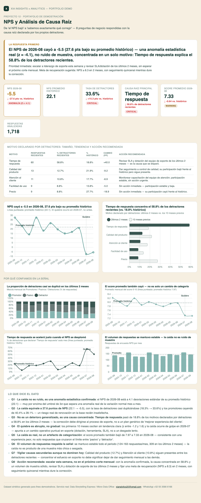

# 12 · NPS y Análisis de Causa Raíz

**Servicio:** Data Storytelling Express / Micro Data Office
**Conecta con:** *"Sabes que algo bajó, pero no por qué ni qué hacer al respecto"* — aquí la causa raíz sale directo de la voz del cliente.

## El problema de negocio

El NPS mensual se reporta como un solo número. Cuando baja, dirección lo sabe, pero nadie traduce ese número en una causa específica y accionable — el resultado suele ser un plan genérico de "mejorar la experiencia del cliente" que no ataca el problema real.

## Qué resuelve este dashboard

- Calcula el NPS mensual (% promotores − % detractores) y valida contra el promedio histórico si una caída es una anomalía real (z-score) o variación normal mes a mes — no reacciona a ruido de muestreo.
- Cruza los detractores recientes con el motivo que ellos mismos declararon, no una suposición del equipo interno, y segmenta cada motivo por tamaño, tendencia (reciente vs. histórico) y acción recomendada.
- Descarta las explicaciones alternativas antes de actuar: revisa si la caída es un artefacto de reclasificación de categoría (compara el score promedio, no solo Promotor/Pasivo/Detractor) y si el volumen de respuestas respalda la señal.
- Sintetiza el análisis en 8 preguntas de negocio (So What / Why / Now What) que dirección y el equipo de soporte necesitan para actuar, con una meta de recuperación y urgencia explícitas — no solo el número de NPS.
- Deja trazabilidad mes a mes del NPS, la mezcla de categorías y el volumen de respuestas para dar seguimiento a si la corrección funcionó.

## Métricas

- **NPS mensual** — `% promotores − % detractores` de las respuestas de cada mes, la métrica estándar de Net Promoter Score aplicada mes a mes en vez de como un número único acumulado.
- **NPS promedio histórico y z-score** — promedio y desviación estándar del NPS mensual excluyendo los últimos 2 meses; el z-score del mes actual contra esa línea base es lo que distingue una anomalía real (>3σ) de la variación normal.
- **Caída en puntos** — `NPS del mes actual − NPS promedio histórico`, con severidad marcada como crítica si la caída supera 10 puntos, de alerta si es negativa pero menor, y saludable si no hay caída.
- **Tasa de detractores y score promedio** — % de respuestas Detractor y promedio del score 0-10 por mes, comparados contra su propio histórico, para confirmar que la caída es una experiencia real y no solo un corrimiento entre categorías.
- **Causa raíz principal y su tendencia** — el motivo declarado con más frecuencia por los detractores de los últimos 2 meses (`motivo_detractor`), su % histórico y su evolución mes a mes, no una hipótesis del equipo interno.
- **Segmentación de motivos** — cada motivo declarado con su tamaño, % reciente vs. histórico, cambio en puntos porcentuales y acción recomendada, para no perder de vista las causas secundarias mientras se corrige la dominante.
- **Volumen de respuestas** — respuestas por mes, para verificar que cada cifra tiene una muestra suficiente y estable detrás, y que la caída no es producto de una muestra más chica o sesgada.

## Cómo se ve



Abre `dashboard.html` para la versión interactiva.

## Datos

`data/generate_data.py` simula 12 meses de respuestas de encuesta NPS con una caída deliberada en los últimos 2 meses, concentrada en un solo motivo declarado por los detractores (tiempo de respuesta de soporte) — el patrón real de una causa raíz aislable, no un deterioro generalizado.

## Stack

Python (pandas, numpy, matplotlib) + HTML/Chart.js.

## Cómo correrlo

```bash
cd projects/12-nps-causa-raiz
python3 data/generate_data.py
python3 run_analysis.py
open dashboard.html
```

## De demo a real

Este es el tipo de análisis de voz del cliente (NPS/CSAT + causa raíz de comentarios) que Diego desarrolló de forma extensa en su etapa en Qualtrics. Con datos reales de encuesta (Qualtrics, SurveyMonkey, Google Forms o un CRM con NPS integrado) el mismo pipeline corre directo sobre el export de respuestas.
