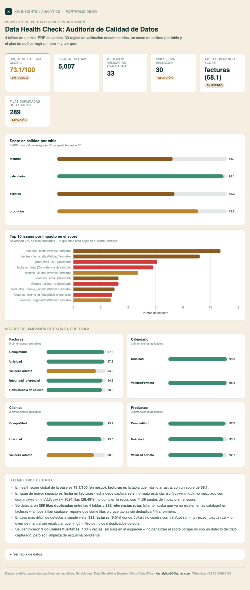

# 13 · Data Health Check: Auditoría de Calidad de Datos

**Servicio:** Micro Data Office (alimenta el sub-score "Calidad" del Foundation Health Dashboard)
**Conecta con:** *"No sabemos qué tan confiables son nuestros datos"* — antes de construir cualquier reporte o modelo, hay que poder responder esa pregunta con un número, no con una opinión.

## El problema de negocio

Todo negocio con un CRM, un ERP o un Excel de control cree que su base de datos está "más o menos bien" — hasta que alguien intenta sumar clientes únicos y el número no cuadra dos veces seguidas, o un reporte de ventas por producto se cae porque la mitad de las líneas de factura apuntan a un SKU que ya no existe. Nadie audita la calidad del dato hasta que ya causó un problema.

## Qué resuelve este proyecto

- Audita 4 tablas relacionales de un mini-ERP de ventas (clientes, productos, calendario, facturas) contra un catálogo de **33 reglas de validación documentadas**, sin conocer de antemano dónde están los problemas.
- Calcula un **score de calidad 0–100 por tabla** (y un score global ponderado por número de filas), a partir de 5 dimensiones: completitud, unicidad, validez/formato, integridad referencial y consistencia de cálculo.
- Entrega una **lista priorizada de issues** por impacto (severidad × % de filas afectadas), no solo un conteo de errores.
- Traduce cada hallazgo en un **plan de remediación accionable**: qué corregir primero y por qué, con una acción recomendada específica por tipo de regla.
- Detecta el tipo de problema que un `.isnull().sum()` rápido no encuentra: referencias rotas entre tablas y un campo calculado (`total`) que no cuadra con sus componentes.

## Cómo se ve



Abre `dashboard.html` para la versión interactiva (KPIs, score por tabla, top 10 issues por impacto, score por dimensión drill-down por tabla y el plan de remediación completo al final).

## Los datos

`data/generate_data.py` genera un "mini-ERP" de ventas sintético — `clientes.csv` (524 filas), `productos.csv` (160 filas), `calendario.csv` (728 filas) y `facturas.csv` (3,595 filas, hechos de facturación con `cliente_id` y `sku` como llaves foráneas) — con problemas de calidad inyectados a propósito y sin marcar, para que `run_analysis.py` los descubra de forma ciega, igual que en una auditoría real:

- **Nulos** en campos obligatorios (`email`, `precio_unitario`, `cliente_id`, `total`...).
- **Duplicados** exactos (misma fila capturada dos veces) y "suaves" (mismo cliente con dos `cliente_id`, mismo SKU recapturado con otro precio).
- **Mayúsculas/minúsculas inconsistentes** en catálogos controlados (`ciudad`, `segmento`, `categoria`, `moneda`) — el mismo valor fragmentado en 2–3 variantes.
- **Formatos mixtos**: fechas en ISO / `DD-MM-YYYY` / `MM-DD-YYYY` en la misma columna, precios como texto de moneda (`"$1,234.50"`) en vez de número.
- **Integridad referencial rota**: líneas de factura cuyo `cliente_id` o `sku` ya no existe en su catálogo (cliente dado de baja, producto descontinuado).
- **Inconsistencia de cálculo**: facturas donde `total ≠ cantidad × precio_unitario` — un override manual sin recalcular, el tipo de problema que ningún filtro de nulos o duplicados detecta.
- **Columnas huérfanas**: 3 campos heredados de sistemas/procesos anteriores, 100% vacíos, que nadie llena ni usa (`campo_legacy_crm_id`, `campo_obsoleto_bodega_2019`, `es_feriado`).

El resultado es un dataset con un health score compuesto de **~73/100** — ni un caso perfecto de juguete ni un caos total: el punto medio real donde vive la mayoría de las bases operativas de una PyME.

## Metodología: cómo se calcula el score

Cada regla de validación se documenta con: tabla, campo, tipo (completitud / unicidad / validez / integridad / consistencia), severidad y descripción. Al correr, cada regla mide qué % de filas la incumple y produce un **impacto en puntos** = peso de severidad × % de filas afectadas:

| Severidad | Peso máximo | Ejemplo de regla |
|---|---|---|
| Crítica | 65 pts | `cliente_id` de una factura debe existir en el catálogo de clientes |
| Alta | 40 pts | `email` no debe estar vacío |
| Media | 20 pts | `categoria` debe respetar la capitalización del catálogo maestro |
| Baja | 9 pts | `nombre_completo` no debe traer espacios extra |
| Informativa | 0 pts | Columna huérfana sin uso (no penaliza el score, se documenta como limpieza de esquema) |

El score de una tabla es `100 − Σ(impacto de sus reglas)`, y el score global es el promedio de los 4 scores de tabla ponderado por número de filas (facturas, con más volumen, pesa más que calendario). El catálogo completo de las 33 reglas — con su resultado — queda documentado en `data/reglas_validacion.csv`, listo para reusarse como checklist en la siguiente auditoría.

## Los 3 entregables

1. **`data/scorecard_calidad_tablas.csv`** — score 0–100 por tabla, con status (Sano / Atención / En riesgo / Crítico).
2. **`data/reglas_validacion.csv`** — las 33 reglas documentadas (tabla, campo, tipo, severidad, descripción) con su resultado: filas evaluadas, filas con hallazgo, % e impacto en puntos. Es a la vez el catálogo de reglas reusable y la lista priorizada de issues.
3. **`data/plan_remediacion.csv`** — cada issue con hallazgo, ordenado por impacto, con la acción recomendada específica (p.ej. "definir `sku` como llave única y deduplicar las 16 filas detectadas antes de usar la tabla en cualquier agregado").

## Stack

Python (pandas, numpy, matplotlib) para el motor de reglas y el score + HTML/Chart.js para el dashboard interactivo.

## Cómo correrlo

```bash
cd projects/13-data-health-check
python3 data/generate_data.py
python3 run_analysis.py
open dashboard.html
```

## De demo a real

Este es el primer entregable de cualquier engagement de Micro Data Office que empieza por "¿qué tan confiables son nuestros datos?": antes de prometer un dashboard o un modelo, hay que auditar la fuente. Con acceso de solo lectura al CRM/ERP/Excel real, el mismo catálogo de reglas (completitud, unicidad, formato, integridad referencial, consistencia de cálculo) se adapta a las tablas y catálogos reales del cliente en un par de días, y el score de calidad se vuelve un número que se puede volver a correr después de cada ronda de limpieza para medir el progreso.
