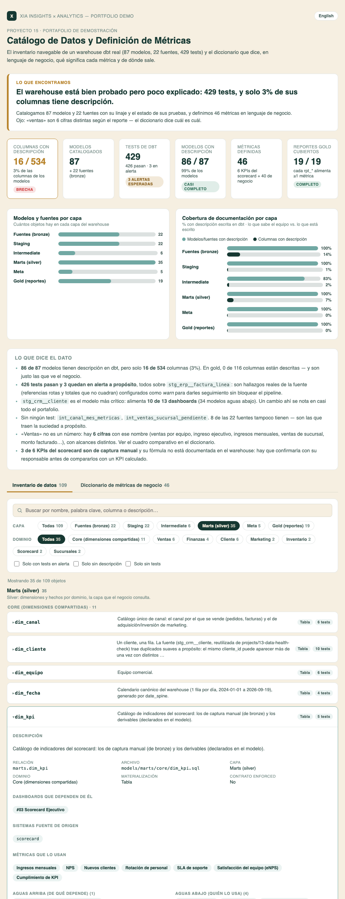

# 15 · Catálogo de Datos y Definición de Métricas

**Servicio:** Micro Data Office (el primer entregable de un dueño fraccional de datos, antes de prometer cualquier dashboard)
**Conecta con:** *"No sabemos qué datos tenemos, ni qué significa cada métrica, y cada persona en el equipo define 'ventas netas' distinto."*

## El problema de negocio

Cuando una empresa acumula CRM, ERP, punto de venta, hojas de cálculo y un par de dashboards, la información existe pero nadie sabe con certeza qué hay, de dónde viene, quién la usa ni qué significa. El síntoma es siempre el mismo: dos personas presentan «ventas» del mismo mes y los números no coinciden, y nadie puede decir cuál es el correcto, porque ambos lo son — miden cosas distintas con el mismo nombre. Mientras eso pase, cualquier dashboard nuevo hereda la discusión.

## Qué resuelve este proyecto

- Cataloga un **warehouse dbt real** (no una simulación): **87 modelos y 22 fuentes** agrupados por capa (bronze, staging, intermediate, marts, meta, gold) y por dominio (core, ventas, finanzas, cliente, marketing, inventario, scorecard, sucursales, calidad de datos), buscables por nombre, palabra clave, columna o descripción.
- Por cada objeto muestra su **descripción, materialización, columnas y tipos, tests y su estado** (429 tests: 426 pasan, 3 en alerta), y su **linaje**: de qué depende, quién lo usa y, sobre todo, **qué dashboards se rompen si cambia** (análisis de impacto transitivo, no solo el vecino directo).
- Incluye un **diccionario de 46 métricas de negocio** (los 6 KPIs de `dim_kpi` + 40 que consumen los 19 reportes gold) en lenguaje no técnico: qué significa, cómo se calcula a grandes rasgos, en qué unidad, dónde se calcula (warehouse, dashboard, captura manual) y qué dashboard la consume.
- Deja al descubierto **dónde el mismo nombre esconde dos números**: seis cifras distintas se leen como «ventas» o «ingreso», y dos cosas distintas se llaman «DSO» — el diccionario las separa con un cuadro comparativo.
- Convierte los huecos en **trabajo priorizado**: qué documentar primero, ordenado por cuántos dashboards dependen de cada objeto.

## Cómo se ve



Abre `dashboard.html` (ES) o `dashboard.en.html` (EN): banner con el hallazgo, KPIs y cobertura de documentación por capa, y dos pestañas — **Inventario de datos** (búsqueda, filtros por capa y dominio, filas expandibles con columnas, tests y linaje navegable) y **Diccionario de métricas de negocio** (búsqueda, filtros por área y por dónde se calcula, y enlaces cruzados al modelo y al dashboard de cada métrica).

Es una página a medida, no el patrón KPI + gráficas de `_lib/dashboard.py`: un catálogo se usa buscando y expandiendo, no leyendo un tablero. Comparte con los otros 13 los mismos tokens de color, tipografía del sistema, tag de proyecto, banner de «la respuesta primero», tarjetas de KPI y modo claro/oscuro.

## Los datos

**No hay dataset sintético que generar**: la materia prima es el propio warehouse de [`warehouse/`](../../warehouse/README.md) (dbt + DuckDB), que corre de verdad — sus datos de origen son 100% sintéticos, así que nada de esto es cifra de un cliente real, pero la infraestructura que se audita es real.

`data/extract_catalog.py` lee los artefactos que dbt deja en `warehouse/target/`:

| Artefacto | Aporta |
|---|---|
| `manifest.json` | modelos, fuentes, descripciones (incluye bloques ``), tests y `depends_on` (el linaje) |
| `catalog.json` | las columnas y tipos **reales** tal como quedaron en DuckDB (el manifest solo lista las columnas declaradas en YAML: 319 de las 534 existentes) |
| `run_results.json` | el resultado de la última corrida de `dbt test` |

**Vivo vs. reproducible: se eligió un snapshot versionado** (`data/catalog_snapshot.json`). `warehouse/target/` está en `.gitignore` (se reconstruye en cada máquina y en CI) y el portafolio se publica como sitio estático, así que depender de que `target/` exista haría que el proyecto no se pueda reconstruir en un clon limpio. El snapshot no está escrito a mano: lo produce el extractor y `extract_catalog.py --check` sale con error si ya no coincide con el warehouse, de modo que es una copia en caché, no una segunda fuente de verdad. `run_analysis.py` solo lee el snapshot y usa únicamente la librería estándar de Python.

Tres detalles del extractor que evitan errores silenciosos:

- **`attached_node` viene vacío** en dbt 1.10 para los 44 tests de fuentes y los 6 singulares; se asignan por el `ref()`/`source()` del test. Sin eso, 50 de los 429 tests desaparecerían del catálogo sin avisar.
- **Orden de comandos:** `dbt docs generate` también escribe `run_results.json` (sin tests reales) y pisa el de `dbt test`. Por eso el orden es `docs generate` **y luego** `test`; el extractor se detiene si el resultado no es de `test`.
- **`dim_kpi`** mezcla KPIs de captura manual (seed) y derivables (declarados en el SQL); el extractor reconstruye ambos desde las mismas dos fuentes y falla si el modelo cambia de forma.

## Metodología

Lo que dbt **sí** sabe (extraído): qué existe, cómo se llama, qué depende de qué, qué tests hay y si pasan. Lo que dbt **no** sabe y alguien decide (curado, versionado en `data/`):

- **`taxonomy.py` — dominios.** Los marts usan su carpeta; staging, intermediate y gold se asignan explícitamente (un modelo sin dominio hace fallar el build, para que uno nuevo no quede huérfano). Se agrega el dominio `calidad` para el motor de calidad de datos.
- **`metrics.py` — definiciones de negocio.** Escritas a mano leyendo el SQL de cada modelo y la lógica de cada dashboard, porque los contratos `rpt_*` solo declaran nombre y tipo de columna. Cada métrica declara dónde se calcula (`warehouse`, `dashboard`, ambos, `manual` o `plan`) y, si aplica, una advertencia.
- **`translations_en.py` — 140 descripciones de dbt en inglés**, para que `dashboard.en.html` quede completo. Un archivo `.lock` guarda el hash del texto en español traducido: si alguien cambia una descripción en dbt, el build avisa que la traducción quedó atrás.

**Todo lo curado se valida contra el warehouse en cada corrida**, así el diccionario no se desactualiza en silencio: los modelos, reportes y columnas que cita deben existir; los KPIs deben ser exactamente los de `dim_kpi`; y **los 19 reportes gold deben estar cubiertos por al menos una métrica** (19/19 hoy). El dashboard que consume cada métrica no se escribe a mano: se deriva de la carpeta de gold del reporte.

**Análisis de impacto:** para cada objeto se recorre el linaje hacia abajo hasta los reportes gold y de ahí al dashboard (`stg_crm__cliente` alimenta 10 de los 13). Hacia arriba se recorre hasta las fuentes para saber de qué sistema viene cada reporte.

## Los 3 entregables

1. **`data/inventario_modelos.csv`** — un renglón por modelo o fuente: capa, dominio, materialización, contrato, documentación, columnas, tests por estado, linaje directo y transitivo, y dashboards que impacta.
2. **`data/diccionario_metricas.csv`** — las 46 métricas: nombre, definición, cómo se calcula, unidad, dónde se calcula, modelos, reportes gold, dashboards y advertencia.
3. **`data/brechas_documentacion.csv`** — qué documentar primero: objetos sin descripción, sin tests o con columnas sin describir, ordenados por número de dashboards que dependen de ellos.

## Lo que encuentra sobre el warehouse

- **86 de 87 modelos** tienen descripción, pero solo **16 de 534 columnas** (3%); en gold, **0 de 116**, justo las columnas que ve el negocio.
- **426 tests pasan y 3 quedan en alerta a propósito**, los tres sobre `stg_erp__factura_linea` (referencias rotas a clientes y SKUs, y totales que no cuadran): hallazgos reales de la fuente, configurados como `warn` para seguirlos sin bloquear el pipeline.
- Dos modelos (`int_canal_mes_metricas`, `int_ventas_sucursal_pendiente`) no tienen ningún test, y `int_canal_mes_metricas` tampoco descripción.
- **«Ventas» son 6 cifras** con alcances distintos (solo canal con vendedor, todos los canales, con o sin sucursales, con facturas del ERP), y **«DSO» son 2 fórmulas** (días promedio de pago por cliente en el warehouse vs. cartera ÷ ventas de 90 días × 90 en el dashboard 08).
- La columna `monto_mxn` de `rpt_facturas` suma ~12% de líneas en USD **sin convertir**.
- 3 de los 6 KPIs del scorecard son de captura manual y su fórmula no está documentada en el warehouse.

Este proyecto **solo documenta**: no modifica `warehouse/`. Cerrar las brechas (descripciones de columnas de gold, tests de los dos modelos, la moneda de las facturas) es trabajo de un siguiente paso, y `brechas_documentacion.csv` es la lista.

## Stack

Python (solo librería estándar) para el extractor y el generador + HTML, CSS y JavaScript sin dependencias para el catálogo interactivo (sin Chart.js ni fuentes externas: funciona sin conexión). dbt + DuckDB como el sistema catalogado.

## Cómo correrlo

```bash
# 1) Refrescar el snapshot desde el warehouse real (opcional: el snapshot ya está versionado)
cd warehouse
python3 -m venv .venv && source .venv/bin/activate
pip install -r requirements.txt
export DBT_PROFILES_DIR=profiles
dbt deps && dbt seed && dbt run
dbt docs generate     # manifest.json + catalog.json
dbt test              # run_results.json  (después de docs generate, no antes)
cd ../projects/15-catalogo-datos-metricas
python3 data/extract_catalog.py            # regenera data/catalog_snapshot.json
python3 data/extract_catalog.py --check    # ¿el snapshot sigue coincidiendo con el warehouse?

# 2) Construir el catálogo (no necesita dbt)
python3 run_analysis.py
open dashboard.html
```

Si cambias una descripción en dbt, actualiza su inglés en `data/translations_en.py` y corre `python3 run_analysis.py --lock-translations`.

## De demo a real

Este es el primer entregable de un engagement de Micro Data Office cuando la pregunta es «¿qué datos tenemos y qué significa cada número?». Con acceso de solo lectura al warehouse (o incluso solo al repo dbt) el catálogo se genera el mismo día, porque **el inventario, el linaje y el estado de los tests salen de los artefactos de dbt, no de entrevistas**. Lo que sí requiere a las personas es el diccionario: se hace en una o dos sesiones con los dueños de cada área, contrastando la definición que dice cada uno contra lo que el SQL realmente calcula — que es donde aparecen las cifras que se llaman igual y no lo son. Después se puede volver a correr tras cada cambio del warehouse: el build falla si una definición apunta a algo que ya no existe, y las brechas se cierran contra una lista priorizada.
