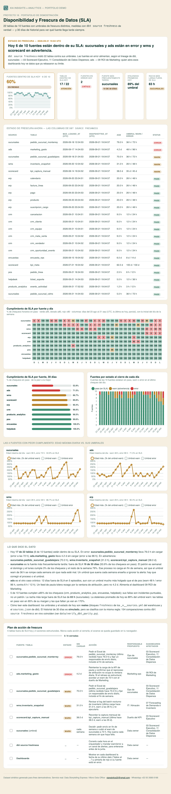

# 16 · Disponibilidad y Frescura de Datos (SLA)

**Servicio:** Micro Data Office (el segundo pilar de gobernanza, junto con la calidad del proyecto 13)
**Conecta con:** *"No sabemos si el dashboard que estamos viendo tiene datos de ayer o de hace dos semanas, hasta que alguien lo nota en una junta."*

## El problema de negocio

Un dato correcto pero viejo hace el mismo daño que uno incorrecto: el reporte cuadra, se ve bien, y nadie sospecha que la fuente dejó de cargar el viernes. Casi ninguna PyME mide cuándo llegó por última vez el dato de cada sistema; se entera cuando alguien en una junta pregunta por qué el número no se movió. La calidad (proyecto 13) responde *"¿el dato es confiable?"*; la frescura responde *"¿es de hoy?"*.

## Qué resuelve este proyecto

- Define un **SLA de frescura por fuente**, con umbrales `warn` y `error` distintos según el tipo de sistema (un POS que carga cada hora no se juzga como un feed de pauta con ventana de atribución).
- Lo configura **en dbt de verdad** (`loaded_at_field` + `freshness`) sobre las 10 fuentes y 22 tablas del [`warehouse/`](../../warehouse/), y usa `dbt source freshness` como fuente de verdad del estado actual.
- Muestra el **historial de 30 días**, porque una foto de un instante no dice si una fuente llega tarde siempre o solo hoy: cumplimiento de SLA por fuente y por día, y las fuentes crónicamente tardías.
- Traduce el estado en un **plan de acción**: qué tabla está fuera de SLA, hace cuánto, qué dashboards alimenta según el lineage de dbt y quién debería moverla.

## Cómo se ve



Abre `dashboard.html` (español) o `dashboard.en.html` (inglés): KPIs, la tabla con las columnas de `dbt source freshness`, el heatmap de 30 días, las 4 fuentes con peor cumplimiento y un checklist de acciones.

## Qué es real y qué es simulado

Esto es lo que separa el proyecto de un dashboard de juguete. Todo dato sigue siendo sintético, pero la parte que dbt puede medir se mide con dbt:

| Pieza | Origen |
|---|---|
| Umbrales `warn`/`error` de las 22 tablas | **Reales**: bloques `freshness` en los `_*__sources.yml` del warehouse |
| Estado de hoy (`max_loaded_at`, `age`, `status`) | **Real**: el `sources.json` que produce `dbt source freshness` (copia en `data/dbt_sources_freshness.json`) |
| Historial de 30 días (cargas hora a hora) | **Simulado** por `data/generate_data.py`, terminando en el `max_loaded_at` real de cada tabla |
| Clasificación pass/warn/error del historial | La **misma regla** que dbt, con prueba de paridad (abajo) |

dbt solo mide el instante presente; no guarda historia. Por eso el historial se simula, y por eso el proyecto demuestra, en vez de afirmar, que la simulación clasifica igual que dbt.

### La config de dbt que se agregó

Extracto de [`warehouse/models/staging/sucursales/_sucursales__sources.yml`](../../warehouse/models/staging/sucursales/_sucursales__sources.yml) (cada uno de los 10 sistemas lleva su propio bloque):

```yaml
sources:
  - name: sucursales
    schema: raw
    # Frescura: Excel diario que mandan las sucursales, sin fines de semana.
    config:
      loaded_at_field: _loaded_at
      freshness:
        warn_after: {count: 36, period: hour}
        error_after: {count: 72, period: hour}
```

y, en `scorecard`, un override por tabla (las metas se revisan por trimestre, la captura manual por mes):

```yaml
      - name: kpi_meta
        config:
          freshness:
            warn_after: {count: 100, period: day}
            error_after: {count: 130, period: day}
```

Umbrales por sistema (los mismos valores que `data/sla_thresholds.csv`, que se genera desde los YAML):

| Fuente | Tipo de carga | warn | error |
|---|---|---|---|
| `producto_analytics` | Eventos casi en tiempo real | 3 h | 12 h |
| `pos` | Ventas transaccionales, EL cada hora | 6 h | 12 h |
| `crm` | SaaS sincronizado varias veces al día | 12 h | 24 h |
| `helpdesk` | API de tickets, sync cada ~6 h | 12 h | 36 h |
| `erp`, `wms` | Batch nocturno (+2 h de holgura) | 26 h | 48 h |
| `sucursales` | Excel diario, sin fines de semana | 36 h | 72 h |
| `ads` | Plataformas de pauta (ventana de atribución) | 48 h | 96 h |
| `encuestas` | Export semanal de NPS | 8 d | 14 d |
| `scorecard` | Captura manual mensual (`kpi_meta`: trimestral, 100 d / 130 d) | 35 d | 45 d |

### De dónde sale `_loaded_at` (y por qué no `batch_ingesta`)

`models/meta/batch_ingesta` registra **una fila por corrida de dbt** (cuándo se *transformó*), con el mismo timestamp para todas las fuentes: no dice cuándo llegó el dato de cada sistema, que es lo que un SLA mide. Se descartó. Lo honesto es lo que hace una fuente real: una columna de carga por tabla que escribe la herramienta de EL (`_fivetran_synced`, `_airbyte_extracted_at`).

Aquí no hay EL, los seeds son CSV estáticos. El post-hook de los seeds ([`macros/stamp_loaded_at.sql`](../../warehouse/macros/stamp_loaded_at.sql)) hace ese papel: agrega `_loaded_at` y lo fija a `now() - <rezago>`, con el rezago de cada fuente declarado en la var `freshness_demo_lag_hours` de `dbt_project.yml`. Un timestamp fijo en el CSV terminaría en `error` en todas las fuentes a las pocas semanas; así el resultado es reproducible el día que se corra. Los CSV de los seeds no cambian.

## Los datos

`data/generate_data.py` toma esos dos insumos reales y simula, para cada tabla, las cargas de los 30 días previos con un perfil operativo por fuente (cadencia, retraso, fallas, incidentes puntuales). Se genera **hacia atrás desde la última carga real**, así el último chequeo del historial es exactamente el estado que dbt reportó. Se "corre" `dbt source freshness` cada hora; el % de cumplimiento de un día es el % de esos chequeos en `pass`, y el de una fuente usa el peor status entre sus tablas.

El historial tiene un patrón operativo realista: **dos fuentes crónicamente tardías** y el resto con incidentes puntuales. Los números de la tabla salen de `data/resumen_fuentes.csv`:

| Fuente | Cumplimiento 30 d | Días fuera de SLA | Por qué |
|---|---|---|---|
| `sucursales` | 53.9% | 19 de 30 | El Excel no se manda en fin de semana: el warn de 36 h se rompe cada domingo y a veces el error de 72 h el lunes, aunque nada esté roto |
| `ads` | 71.5% | 12 de 30 | Se salta cargas mientras se reprocesa la atribución; ya va en 4.2 días |
| `wms`, `scorecard`, `erp` | 87–90% | 4–8 | Un batch fallido, una captura manual atrasada, dos noches sin batch |
| `crm`, `producto_analytics`, `pos`, `encuestas`, `helpdesk` | ≥96% | 0–2 | Incidentes puntuales |

Los perfiles están en `PROFILES` (arriba de `generate_data.py`) y la ventana, la semilla y el tamaño de la historia son constantes del mismo archivo. El lineage "qué dashboards alimenta cada fuente" sale del catálogo del proyecto 15, sin cruzar las dimensiones compartidas (si no, `ads` "alimentaría" todos los dashboards de ventas por `dim_canal`).

## Prueba de que está conectado a dbt

[`data/verify_dbt_parity.py`](data/verify_dbt_parity.py) compara la clasificación de la simulación contra dbt. Resultado de la última corrida (detalle en [`data/parity_report.csv`](data/parity_report.csv), 154 comparaciones):

| | Qué compara | Resultado |
|---|---|---|
| **A. Config** | Umbrales en el YAML = `sla_thresholds.csv` (lo que usa la simulación) = `criteria` en el `sources.json` de dbt | 22/22 tablas idénticas |
| **B. Foto real** | `status` que reportó dbt vs. la simulación, sobre el `sources.json` versionado | 22/22 |
| **C. Fronteras** | `dbt source freshness` **en vivo** (sobre una copia desechable de la base) con la edad de cada tabla al 0.5×, 0.98× y 1.02× del warn, y 0.98×, 1.02× y 3× del error | 132/132 (6 escenarios × 22 tablas) |
| **D. Igualdad** | Contra `FreshnessThreshold.status` de dbt-core, con la edad exactamente en el umbral y un segundo a cada lado (la comparación es estricta: igual al umbral **no** lo excede) | 132/132 |

El test tiene dientes: cambiar en `freshness_rules.py` la comparación `>` por `>=` hace fallar la comprobación D (solo 110/132 coinciden) y el script sale con código 1. Además, `run_analysis.py` se niega a construir el dashboard si `parity_report.csv` trae alguna diferencia.

## Metodología: cómo se calcula cada número

- **Estado (pass/warn/error):** `age = snapshotted_at − max(_loaded_at)`; `error` si `age > error_after`, si no `warn` si `age > warn_after`, si no `pass`. Es `freshness_rules.classify`, réplica de dbt-core.
- **Fuente dentro de SLA hoy:** todas sus tablas en `pass`. **% de fuentes dentro de SLA** = fuentes en SLA / 10.
- **Cumplimiento de SLA (día):** % de los chequeos horarios del día con status `pass`. El último día es parcial (hasta el instante de la foto).
- **Fuente más frecuentemente tardía:** la de más días con al menos un chequeo fuera de `pass`.
- **Staleness promedio:** promedio de `age / warn_after` de las 22 tablas (100% = exactamente en el umbral de advertencia).
- **Racha más larga fuera de SLA:** horas seguidas de chequeos que no son `pass`.

## Entregables

1. **`dashboard.html` / `dashboard.en.html`** — KPIs, estado actual por tabla (las columnas de `dbt source freshness`), heatmap de 30 días, cumplimiento por fuente, estado diario, las 4 fuentes con peor cumplimiento, hallazgos y checklist de acciones.
2. **`data/dbt_sources_freshness.json`** — el `sources.json` real de dbt (la foto del instante).
3. **`data/sla_thresholds.csv`, `sla_diario_fuente.csv`, `sla_diario_tabla.csv`, `resumen_fuentes.csv`, `frescura_actual.csv`, `cargas_simuladas.csv`, `dashboards_por_fuente.csv`** — la salida del harness, lista para reusar.
4. **`data/parity_report.csv`** — la evidencia de paridad con dbt, fila por fila.

## Stack

dbt (`source freshness`) + DuckDB para lo real; Python (pandas, numpy) para el harness y HTML/Chart.js para el dashboard, sobre la librería compartida `_lib/`. El heatmap usa un modo de color por estado (`bands`) que se agregó a `_lib/dashboard.py`; es opcional y no cambia los otros dashboards.

## Cómo correrlo

Reconstruir todo desde el warehouse (necesita el venv de `warehouse/`, que trae dbt y PyYAML):

```bash
cd warehouse
source .venv/bin/activate && export DBT_PROFILES_DIR=profiles
dbt seed                                                  # sella _loaded_at en cada fuente
python ../projects/16-frescura-disponibilidad-datos/data/sync_from_dbt.py --run   # umbrales del YAML + dbt source freshness
python ../projects/16-frescura-disponibilidad-datos/data/verify_dbt_parity.py     # prueba de paridad contra dbt en vivo
deactivate
```

Y el dashboard (Python con pandas/numpy/matplotlib; no necesita dbt):

```bash
cd projects/16-frescura-disponibilidad-datos
python3 data/generate_data.py
python3 run_analysis.py
open dashboard.html
```

`dbt source freshness` sale con código distinto de cero cuando hay fuentes en `error`; aquí es lo esperado (hay dos), por eso `dbt_ci.yml` no lo corre como paso bloqueante.

## De demo a real

Con un cliente, el mismo esquema se monta sobre sus fuentes reales: la columna de carga ya existe (`_fivetran_synced`, `_airbyte_extracted_at`, o un `updated_at` confiable), así que basta el bloque `freshness` por sistema, umbrales acordados con el dueño de cada fuente y `dbt source freshness` corriendo cada hora en el orquestador con alertas a un canal. `dbt` no guarda historia, así que el paso que aporta el historial real es persistir cada resultado (por ejemplo, un modelo incremental sobre `sources.json`, como ya hace `meta/batch_ingesta` con las corridas), y la simulación de este proyecto se sustituye por esa tabla. Los umbrales se ajustan con el historial en la mano: es lo que muestra el caso `sucursales`, donde un umbral que suena cada semana sin que haya falla real solo enseña a ignorar la alerta.
